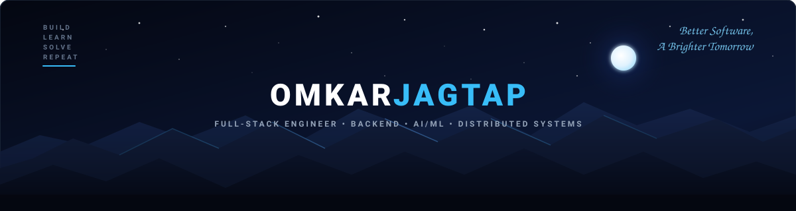
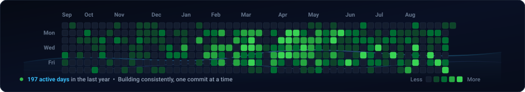

  

  
  &nbsp;•&nbsp;
  
  &nbsp;•&nbsp;
  
  &nbsp;•&nbsp;
  

---

### 🌊 Contribution Flow

  Building consistently, one contribution at a time.

  

---

### 👨‍💻 About Me

<table>
<tr>
<td width="100" align="center" valign="middle">
  
</td>
<td valign="middle">

**Hi there! 👋 I'm Omkar Jagtap**  
Full-Stack Engineer building scalable backend systems, AI-powered products, and low-latency data pipelines.
- 🎓 **Mathematics & Computing @ BIT Mesra** (Integrated M.Sc. 2022–2027 • 8.54 CGPA)
- 🚀 **Passionate about Backend Architecture • AI/ML • Distributed Systems**

*"Curious learner, consistent builder, always a work in progress."*

</td>
</tr>
</table>

---

### 🏆 Key Proof & Highlights

  

---

### 🛠️ Skills

#### 💻 Languages

#### 🎨 Frontend

#### ⚙️ Backend

#### 🗄️ Databases

#### 🧰 Tools & Platforms

#### 🧠 Core (CS Fundamentals)

---

### 💼 Work Experience

<table>
<tr>
<td width="50%" valign="top">

#### 🤖 Emplo AI
**Backend Developer (Intern)**  
*Oct 2025 – Dec 2025*

- Built an end-to-end AI technical interviewing platform in **React & Node.js** with LLM evaluation pipelines, reducing initial recruiter screening workload by **70%**.
- Architected a low-latency 3-stage voice processing pipeline (STT, LLM inference, TTS) with **FFmpeg** audio transcoding, cutting feedback latency to **< 800ms**.
- Engineered **6 RESTful APIs** backed by indexed **MongoDB** schemas for analytics and session replays across **100+ active sessions**.

`Node.js` `Express` `MongoDB` `FFmpeg` `LLMs`

</td>
<td width="50%" valign="top">

#### 🏢 Rootform Consultancy
**Full-Stack Developer (Freelance)**  
*Jun 2026 – Jul 2026*

- Architected and deployed a responsive Jamstack web app using **React 19**, **Vite**, and **Tailwind CSS**, integrated with **Sanity headless CMS** for modular, client-controlled content delivery.
- Engineered a zero-cost serverless backend on **Google Apps Script** & **Google Sheets** for validated form ingestion and email alerts (**$0 infrastructure cost**).
- Solved CORS preflight constraints via a custom `text/plain` payload protocol paired with defensive JSON validation, honeypot anti-spam, and rate throttling.

`React 19` `Vite` `Tailwind CSS` `Sanity CMS` `Apps Script`

</td>
</tr>
</table>

---

### 📁 Featured Projects

#### 🎬 [Cinemate — AI-Powered Movie Discovery & Recommendation Engine](https://github.com/Omkarjagtap15/Cinemate)
*Production movie intelligence platform featuring sub-15ms Redis caching and AI vector discovery.*

- **Vector Semantic Search**: Implemented high-precision semantic search using **PostgreSQL `pgvector`** and 1536-dimensional OpenAI embeddings, delivering sub-50ms cosine-similarity ranking with deterministic fallback.
- **Single-Flight Request Coalescing**: Built multi-tier Redis caching with custom single-flight Promise deduplication, eliminating the *thundering herd* effect, cutting upstream API traffic by **75%+**, and reducing P95 latency from 450ms to **under 15ms**.
- **Asynchronous Queue Pipeline**: Designed a **BullMQ 3-queue pipeline** for catalog ingestion, embeddings, and recommendations with 3x worker concurrency and exponential backoff (processing **280+ movies per cycle**).
- **Security & Telemetry**: Built an administrative latency telemetry console with sliding-window rate limiting (20 req/min). *(Demo telemetry dashboard available on request).*

`Next.js` `Node.js` `Express` `PostgreSQL` `pgvector` `Redis` `BullMQ` `OpenAI` `Docker`

[🌐 Live Demo](https://cinemate-jktz.onrender.com) &nbsp;•&nbsp; [💻 Source Code](https://github.com/Omkarjagtap15/Cinemate)

---

#### ⚡ [QuickAI — Multi-Modal AI SaaS Productivity Platform](https://github.com/Omkarjagtap15/QuickAI)
*Multi-modal AI workspace featuring provider-agnostic LLM swapping, PDF extraction, and tiered subscriptions.*

- **Provider-Agnostic LLM Layer**: Architected a pluggable abstraction layer adapting the OpenAI SDK to Google Gemini endpoints, allowing dynamic provider switching with **zero controller-code changes**.
- **Tier-Based Access Control**: Built plan-aware authorization middleware using Clerk JWTs, gating 6 AI productivity tools and tracking free quotas directly in user metadata without extra database roundtrips.
- **Multi-Modal Document Processing**: Orchestrated Gemini, ClipDrop, and Cloudinary pipelines behind a unified controller, handling image transformations and serverless PDF text parsing (`pdf-parse`).

`React` `Node.js` `Express` `Tailwind CSS` `PostgreSQL (Neon)` `OpenAI` `Gemini` `Clerk`

[💻 Source Code](https://github.com/Omkarjagtap15/QuickAI)

---

#### 📈 [FinPulse — Dynamic Exposure & Liquidity Risk Monitor](https://github.com/Omkarjagtap15/FinPulse)
*Proactive predictive risk intelligence platform forecasting banking liquidity distress 30 days ahead.*

- **Predictive Time-Series Analytics**: Developed predictive models using **Holt-Winters Exponential Smoothing** across 1,000 retail banking profiles in 8 behavioral segments, identifying distress trends weeks before overdraft breaches occur.
- **Early Warning Signals (EWS)**: Configured automated multi-tier risk thresholds for proactive relationship manager interventions.
- **AI-Powered Synthesized Insights**: Integrated Google Gemini 1.5 Flash to automatically translate complex time-series volatility trends into clear executive risk briefings.

`Python` `Streamlit` `Scikit-Learn` `Plotly` `Gemini 1.5 Flash` `Docker`

[🌐 Live Demo](https://finpulse-4emtrj3zww3kb4cmfxi6vl.streamlit.app/) &nbsp;•&nbsp; [💻 Source Code](https://github.com/Omkarjagtap15/FinPulse)

---

#### 👥 [InterviewMentorAI — AI-Powered Technical Interview Platform](https://github.com/Omkarjagtap15/InterviewMentorAI)
*Interactive AI interview simulation platform delivering real-time candidate assessment and personalized feedback.*

- **Real-Time Assessment**: Utilizes prompt-engineered LLM evaluation chains to critique candidate responses against standardized technical rubrics.
- **Dynamic Multi-Vector Scoring**: Assesses code complexity, algorithmic efficiency, system design tradeoffs, and communication clarity.
- **Adaptive Questioning Engine**: Synthesizes follow-up probing questions dynamically based on previous candidate answers to simulate real-world engineering interviews.

`TypeScript` `Next.js` `Tailwind CSS` `Gemini AI` `PostgreSQL`

[💻 Source Code](https://github.com/Omkarjagtap15/InterviewMentorAI)

---

<b>📦 Other Noteworthy Projects</b>

 

- **[Cafeecafii](https://github.com/Omkarjagtap15/Cafeecafii)** — Aesthetic café web application with fluid dark typography, responsive grid layouts, and smooth micro-interactions. (`Next.js`, `TypeScript`, `Tailwind CSS`)
- **[Greenery](https://github.com/Omkarjagtap15/greenery)** — Git workflow and contribution timeline automation engine with terminal canvas rendering. (`Node.js`, `Git Automation`)

---

### 🎓 Education & Beyond Code

<table>
<tr>
<td width="50%" valign="top">

#### 🎓 Education

**Birla Institute of Technology, Mesra**  
*Integrated M.Sc. in Mathematics and Computing*  
2022 – 2027 • **CGPA: 8.54 / 10.0**  
Awarded **3× G.P. Birla Scholarship** for academic excellence.

</td>
<td width="50%" valign="top">

#### 💡 Beyond Code

- ♟️ **Competitive Programming**: LeetCode Knight (1874 rating, 750+ solved)
- ⚙️ **Systems & AI**: Exploring distributed systems and LLM workflows
- 🏃 **Fitness & Wellness**: Running, endurance training, and long walks
- 🛠️ **Developer Tooling**: Crafting scripts and automating developer workflows

*"Same curiosity. Different problems. Always learning."*

</td>
</tr>
</table>

---

### 🚀 Let's Connect

Always open to discussing software engineering roles, distributed systems, AI architectures, or open-source collaborations.

  
  &nbsp;
  
  &nbsp;
  
  &nbsp;
  

  Made with ❤️ by <b>Omkar Jagtap</b> &nbsp;•&nbsp; Thanks for visiting! ⭐

